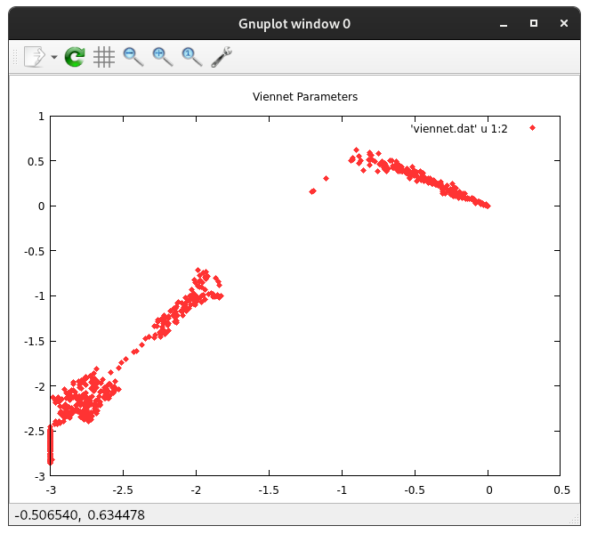
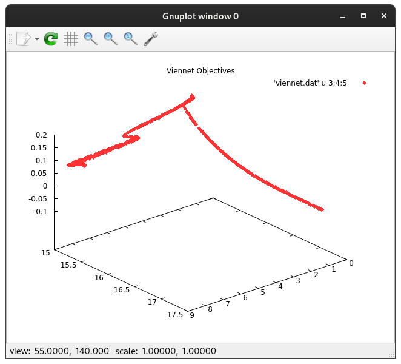

<h1 align="center">
    Lyrahgames' Multi-Objective Optimization Package
</h1>

<p align="center">
    Header-Only C++ Library for the Estimation of N-Dimensional Pareto Frontiers
</p>

<table align="center">
    <tr>
        <td></td>
        <td></td>
    </tr>
</table>

## Development Status

<p align="center">
    
    
    
    <a href="COPYING.md">
        
    </a>
</p>

<b>
<table align="center">
    <tr>
        <td>
            master
        </td>
        <td>
            <a href="https://github.com/lyrahgames/pareto">
                
            </a>
        </td>    
        <!-- <td>
            <a href="https://circleci.com/gh/lyrahgames/pareto/tree/master"></a>
        </td> -->
        <!-- <td>
            <a href="https://codecov.io/gh/lyrahgames/pareto">
              
            </a>
        </td> -->
        <td>
            <a href="https://ci.cppget.org/?builds=lyrahgames-robin-hood&pv=&tc=*&cf=&mn=&tg=&rs=*">
                
            </a>
        </td>
    </tr>
    <!-- <tr>
        <td>
            develop
        </td>
        <td>
            <a href="https://github.com/lyrahgames/pareto/tree/develop">
                
            </a>
        </td>    
        <td>
            <a href="https://circleci.com/gh/lyrahgames/pareto/tree/develop"></a>
        </td>
        <td>
            <a href="https://codecov.io/gh/lyrahgames/pareto">
              
            </a>
        </td>
    </tr> -->
    <tr>
        <td>
        </td>
    </tr>
    <tr>
        <td>
            Current
        </td>
        <td>
            <a href="https://github.com/lyrahgames/pareto">
                
            </a>
        </td>
        <!-- <td>
            
        </td>
        <td>
            
        </td> -->
        <td>
            
        </td>
        <td>
            
        </td>
        <!-- <td>
            <a href="https://queue.cppget.org/robin-hood">
                
            </a>
        </td> -->
    </tr>
</table>
</b>

## Requirements
<b>
<table>
    <tr>
        <td>Language Standard:</td>
        <td>C++20</td>
    </tr>
    <tr>
        <td>Build System:</td>
        <td>
            <a href="https://build2.org/">build2</a>
        </td>
    </tr>
    <tr>
        <td>Operating System:</td>
        <td>
            Linux<br>
            Windows<br>
            MacOS
        </td>
    </tr>
    <tr>
        <td>Dependencies:</td>
        <td>
            <a href="https://github.com/lyrahgames/xstd">
                lyrahgames-xstd
            </a>
            <br>
            <a href="https://github.com/lyrahgames/gnuplot-pipe">
                lyrahgames-gnuplot-pipe
            </a>
            <br>
            <a href="https://cppget.org/doctest">
                doctest
            </a>
        </td>
    </tr>
</table>
</b>

## Getting Started
```c++
#include <chrono>
#include <fstream>
#include <iomanip>
#include <iostream>
#include <random>
//
#include <lyrahgames/gnuplot_pipe.hpp>
//
#include <lyrahgames/pareto/pareto.hpp>
#include <lyrahgames/pareto/gallery/gallery.hpp>

using namespace std;
using namespace lyrahgames;
using namespace lyrahgames::pareto;

using real = float;

int main() {
  mt19937 rng{random_device{}()};

  using clock = chrono::high_resolution_clock;
  const auto start = clock::now();

  // Choose problem, estimate the Pareto frontier, and cast it to a usable
  // output format in one step.
  const auto pareto_front = nsga2::optimization<frontier<real>>(
      gallery::zdt3<real>, rng, {.iterations = 1000, .population = 1000});

  const auto end = clock::now();
  const auto time = chrono::duration<double>(end - start).count();
  cout << setw(20) << "time = " << setw(20) << time << " s\n";

  // Store the data into a file for plotting.
  fstream file{"zdt3.dat", ios::out};
  for (size_t i = 0; i < pareto_front.sample_count(); ++i) {
    for (auto y : pareto_front.objectives(i))
      file << setw(20) << y << ' ';
    file << '\n';
  }
  file << flush;

  // Plot the data.
  gnuplot_pipe yplot{};
  yplot << "plot 'zdt3.dat' u 1:2 w p lt rgb '#ff3333' pt 13\n";
}
```

## Build, Test, and Install

## Usage with build2
Add this repository to the `repositories.manifest` file of your build2 package.

    :
    role: prerequisite
    location: https://github.com/lyrahgames/pareto.git

Add the following entry to the `manifest` file with a possible version dependency.

    depends: lyrahgames-pareto

Add these entries to your `buildfile`.

    import libs = lyrahgames-pareto%lib{lyrahgames-pareto}
    exe{your-executable}: {hxx cxx}{**} $libs


## Installation
The standard installation process will only install the header-only library with some additional description, library, and package files.

    bpkg -d build2-packages cc \
      config.install.root=/usr/local \
      config.install.sudo=sudo

Get the latest package release and build it.

    bpkg build https://github.com/lyrahgames/pareto.git

Install the built package.

    bpkg install lyrahgames-pareto

For uninstalling, do the following.

    bpkg uninstall lyrahgames-pareto

If your package uses an explicit `depends: lyrahgames-pareto` make sure to initialize this dependency as a system dependency when creating a new configuration.

    bdep init -C @build cc config.cxx=g++ "config.cxx.coptions=-O3" -- "?sys:lyrahgames-pareto/*"

## Usage and Examples

## Background

## Additional Information
- [Authors](AUTHORS.md)
- [License](COPYING.md)

## References
- [Self-Adaptive Parent to Mean-Centric Recombination for Real-Parameter Optimization](https://www.iitk.ac.in/kangal/papers/k2011001.pdf)
- [Simulated Binary Crossover for Continuous Search Space](https://content.wolfram.com/uploads/sites/13/2018/02/09-2-2.pdf)
- [Real-Coded Genetic Algorithms: Crossovers and Mutations](https://engineering.purdue.edu/~sudhoff/ee630/Lecture04.pdf)
- [Test Functions for Optimization](https://en.wikipedia.org/wiki/Test_functions_for_optimization)
- https://github.com/philippwirth/nsga2
- https://github.com/OscarPudding/NSGA2_python